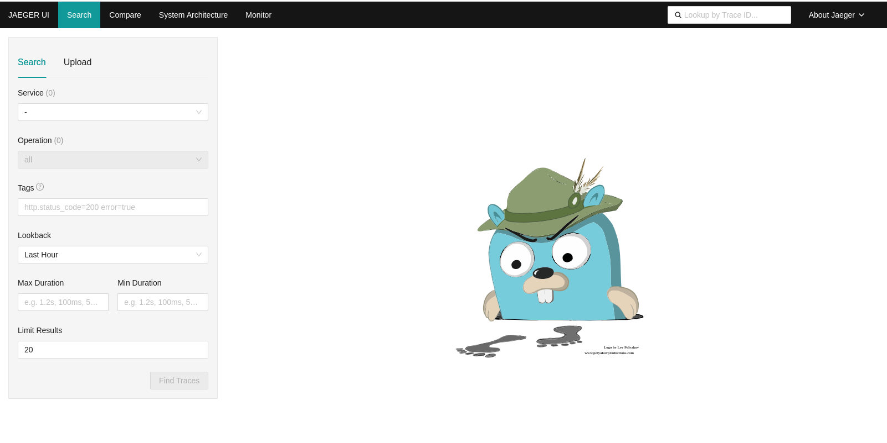
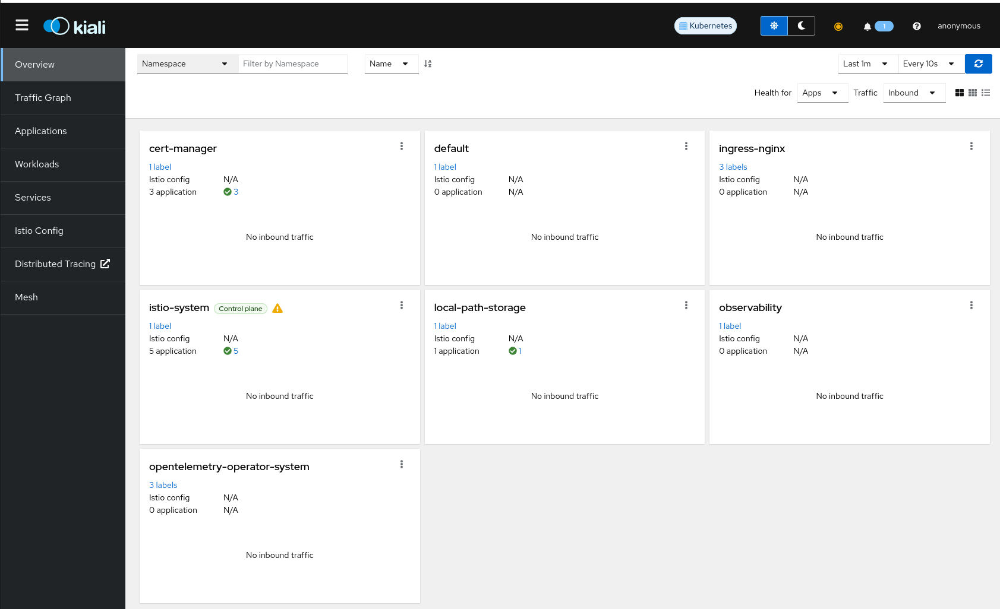
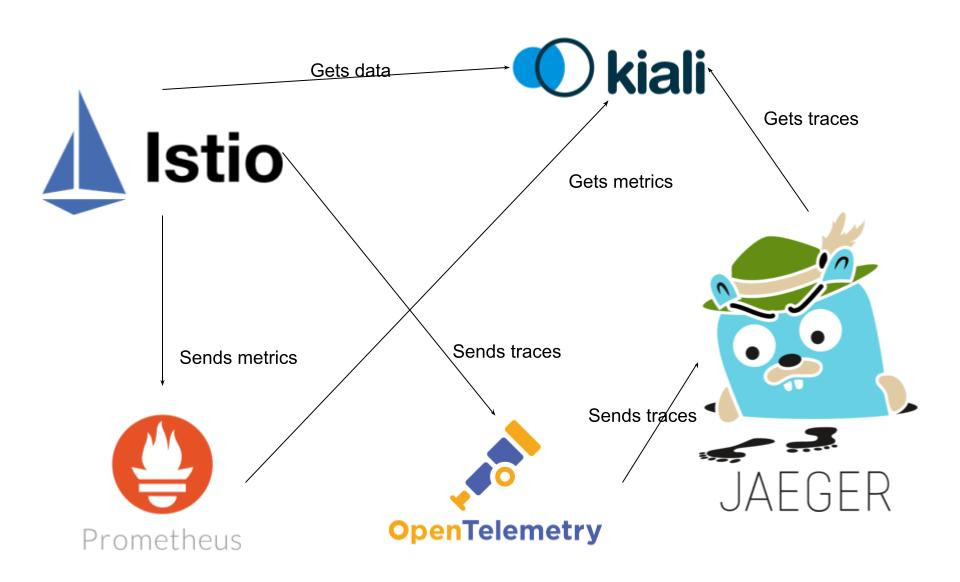

# 01- Infrastructure

After installing the dependencies (operators and other stuff), we are going to deploy the infrastructure for the tutotial. That means: all the tools that we need to use in order to have an observable environment using Service Mesh.

## Deploy the infrastructure

TL;DR: run `make infra`.

### Istio

[Istio](https://istio.io/) is a comprehensive service mesh that provides a suite of powerful features to manage, secure, and observe microservices. One of its core functionalities is traffic management, which includes sophisticated routing capabilities to control API calls and traffic flows between services. This allows for load balancing, traffic splitting for blue-green deployments or canary releases, and resilience features like retries, timeouts, and circuit breakers.

In terms of security, Istio enhances service-to-service communication by implementing mutual TLS (mTLS) for authentication and encryption, ensuring that data in transit is protected. Additionally, Istio enforces fine-grained authorization policies to control access to services, enhancing the overall security posture of the microservices architecture.

For observability, Istio collects metrics and logs out-of-the-box, integrating with systems like Prometheus for metrics collection and Jaeger or Zipkin for distributed tracing. This enables detailed insights into service behavior and performance, facilitating effective monitoring and troubleshooting. Centralized logging further aids in debugging by aggregating logs from all services in the mesh.

Policy enforcement in Istio allows for rate limiting to prevent abuse, setting quotas to manage resource usage, and applying access policies to control service interactions. Istio's extensibility features enable the integration of custom policies and telemetry using WebAssembly (Wasm) plugins, as well as extending the service mesh with third-party tools.

Istio also provides dynamic service discovery, automatically detecting services and endpoints, which simplifies management and scaling. The centralized configuration management capability allows administrators to manage traffic routing, policies, and telemetry from a single control plane, streamlining operations and reducing complexity.

Overall, Istio's feature set makes it an essential tool for managing modern microservices architectures, offering robust solutions for traffic management, security, observability, policy enforcement, extensibility, service discovery, and configuration management. These features collectively enhance the reliability, security, and performance of applications running in distributed environments​ (GitHub)​​ (GitHub)​.

First, we will deploy the service mesh.


You can install it with `make istio`.

To verify that Istio was deployed properly, check the pod status:
```sh
$ kubectl get pods -n istio-system                 
NAME                      READY   STATUS    RESTARTS   AGE
istiod-54dcd8b99f-nhcz8   1/1     Running   0          3m39s
```

### Prometheus

[Prometheus](https://prometheus.io/) is an open source monitoring system and time series database. You can use Prometheus with Istio to record metrics that track the health of Istio and of applications within the service mesh. 

Istio allow the installation of addons for tools that are commonly used to complete its features. To deploy Prometheus, we will use the Prometheus addon for Istio:

```sh
$ kubectl apply -f https://raw.githubusercontent.com/istio/istio/release-1.22/samples/addons/prometheus.yaml
serviceaccount/prometheus created
configmap/prometheus created
clusterrole.rbac.authorization.k8s.io/prometheus created
clusterrolebinding.rbac.authorization.k8s.io/prometheus created
service/prometheus created
deployment.apps/prometheus created
```

### OpenTelemetry Collector
The [OpenTelemetry Collector](https://opentelemetry.io/docs/collector/) is a versatile and highly configurable component within the OpenTelemetry project, designed to receive, process, and export telemetry data such as traces, metrics, and logs. It provides a unified way to handle telemetry data, which can originate from a variety of sources and be sent to multiple destinations.

```sh
$ kubectl apply -f infra/otelcol.yaml
opentelemetrycollector.opentelemetry.io/instance created
```

To verify the `OpenTelemetryCollector` was deployed properly, you can run the following command:
```sh
$ kubectl get otelcol -n istio-system
NAME       MODE         VERSION   READY   AGE     IMAGE                                                                                     MANAGEMENT
instance   deployment   0.101.0   1/1     5m20s   ghcr.io/open-telemetry/opentelemetry-collector-releases/opentelemetry-collector:0.101.0   managed
```

### Jaeger
[Jaeger](https://www.jaegertracing.io/docs/1.57/) is an open-source, end-to-end distributed tracing system used for monitoring and troubleshooting microservices-based applications. It helps track the flow of requests through various services, providing insights into service latencies, root causes of performance issues, and service dependencies. Developed initially by Uber Technologies and now part of the Cloud Native Computing Foundation (CNCF), Jaeger supports various features such as context propagation, distributed context management, and spans and traces collection. It integrates with a wide range of tools and platforms, facilitating the visualization of request flows and pinpointing issues within complex microservice architectures, ultimately enhancing the observability and reliability of distributed systems​​​​.

For this tutorial we will deploy a Jaeger instance that will store all the traces in memory. This deployment mode is called "all in one" and is good for testing or demo purposes.
```sh
$ kubectl apply -f infra/jaeger.yaml
jaeger.jaegertracing.io/jaeger created
```

To verify the status of our Jaeger instance, we can run the following command:
```sh
$ kubectl get jaeger -n istio-system
NAME     STATUS    VERSION   STRATEGY   STORAGE   AGE
jaeger   Running   1.57.0    allinone   memory    91m
```

The Jaeger operator will have create an Ingress to the Jaeger instance in your cluster. You should be able to acces Jaeger UI via [http://localhost/](http://localhost).



If you refresh the webpage (`F5`) the `Service` dropdown will be populated by `jaeger-all-in-one`. Jaeger itself is instrumented for traces. Each time you query Jaeger or access the UI, new traces will be generated.

### Kiali

[Kiali](https://kiali.io/) is an open-source observability console for Istio service mesh, providing a visual interface to manage and monitor microservices within the mesh. It offers detailed insights into the structure, health, and performance of the microservices, allowing users to visualize service interactions, traffic flow, and dependencies. Kiali integrates with other observability tools like Jaeger for tracing and Prometheus for metrics, enabling comprehensive monitoring and debugging capabilities. It also provides features for validating Istio configurations, identifying potential issues, and facilitating the efficient operation and troubleshooting of microservices in a service mesh environment.

> [!WARNING]  
> Note we're not using the [Kiali addon](https://istio.io/latest/docs/ops/integrations/kiali/) for Istio because tracing is disabled in this integration.

You can deploy your Kiali instance with this command:

```sh
$ kubectl apply -f infra/kiali.yaml
kiali.kiali.io/kiali created
```

We can verify Kiali is ready with this command:
```sh
$ kubectl get deployment -n istio-system kiali
NAME    READY   UP-TO-DATE   AVAILABLE   AGE
kiali   1/1     1            1           98m
```

To acces the Kiali UI, you need to forward the traffic to the `20001` port:
```
$ kubectl port-forward svc/kiali 20001 -n istio-system
```

And access [http://localhost:20001/](http://localhost:20001/).




## Our setup
After deploying all the components, need to visualize the data flow:

