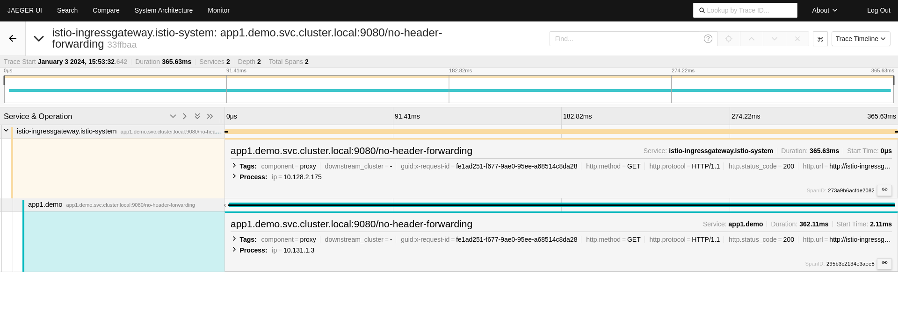

# 02 - Deploying workloads

## Deploying the applications

Now we will deploy a project with some applications in our Istio Service Mesh. To do that, we just need to deploy the resources from the `apps/manifest.yaml` manifest:

```sh
$ kubectl apply -f apps/manifest.yaml
```

As part of that manifest, we create the namespace where our applications will be deployed and add the `istio-injection` to tell Istio we want to inject its sidecars in the applications running in that namespace.

```yaml
apiVersion: v1
kind: Namespace
metadata:
  name: demo
  labels:
    istio-injection: enabled
```

TODO: add get app output

We can verify that our application is working properly with the following command:
```sh
$ kubectl get pods -n demo
```

Note that all the pods from the applications we deployed have 2 containers: the application container and the `istio-proxy` container.

## Querying the application

If you check the application manifest, you will not only find the `Services` and `Deployments` for the application but these 3 resources: `Gateway`, `VirtualService` and `DestinationRule`.

[`Gateway`](https://istio.io/latest/docs/reference/config/networking/gateway/) is used to describe a load balancer that allows HTTP/TCP connections going into the Service Mesh.

```yaml
apiVersion: networking.istio.io/v1alpha3
kind: Gateway
metadata:
  name: demo-gateway
  namespace: demo
spec:
  selector:
    istio: ingressgateway
  servers:
  - port:
      number: 80
      name: http
      protocol: HTTP
    hosts:
    - "*"
```

[`VirtualService`](https://istio.io/latest/docs/reference/config/networking/virtual-service/#VirtualService) specifies the routing rules for the `Gateway`.

```yaml
apiVersion: networking.istio.io/v1alpha3
kind: VirtualService
metadata:
  name: demo
  namespace: demo
spec:
  hosts:
  - "*"
  gateways:
  - demo-gateway
  http:
  - match:
    - uri:
        exact: /no-header-forwarding
    route:
    - destination:
        host: app1
        port:
          number: 9080
  - match:
    - uri:
        exact: /header-forwarding
    route:
    - destination:
        host: app1
        port:
          number: 9080
```

And, finally, [`DestinationRule`](https://istio.io/latest/docs/reference/config/networking/destination-rule/#DestinationRule) declares policies that apply to traffic intended for a service after routing has occurred.

```yaml
apiVersion: networking.istio.io/v1alpha3
kind: DestinationRule
metadata:
  name: app1
  namespace: demo
spec:
  host: app1
  subsets:
  - name: v1
    labels:
      version: v1
```

To access our application from outside the cluster we first need to run `cloud-provider-kind` in a separate terminal. You just need to run the `cloud-provider-kind` application and keep it in the background.

> [!TIP]
> If you are using `minikube` to deploy the cluster, ensure you are running `minikube tunnel` in a different terminal.

Now, we need to set some environment variables that will provide us the final URL to our application:
```sh
export INGRESS_NAME=istio-ingressgateway
export INGRESS_NS=istio-system
```

To check that everything is working fine, run:
```
$ kubectl get svc "$INGRESS_NAME" -n "$INGRESS_NS"
NAME                   TYPE           CLUSTER-IP     EXTERNAL-IP   PORT(S)                                                                      AGE
istio-ingressgateway   LoadBalancer   10.96.156.72   172.18.0.3    15021:31672/TCP,80:31580/TCP,443:32620/TCP,31400:31280/TCP,15443:30330/TCP   143m
```

If the `EXTERNAL-IP` field is not set to an IP, check the [Istio official documentation](https://istio.io/latest/docs/tasks/traffic-management/ingress/ingress-control/).

```sh
export INGRESS_HOST=$(kubectl -n "$INGRESS_NS" get service "$INGRESS_NAME" -o jsonpath='{.status.loadBalancer.ingress[0].ip}')
export INGRESS_PORT=$(kubectl -n "$INGRESS_NS" get service "$INGRESS_NAME" -o jsonpath='{.spec.ports[?(@.name=="http2")].port}')
export SECURE_INGRESS_PORT=$(kubectl -n "$INGRESS_NS" get service "$INGRESS_NAME" -o jsonpath='{.spec.ports[?(@.name=="https")].port}')
export TCP_INGRESS_PORT=$(kubectl -n "$INGRESS_NS" get service "$INGRESS_NAME" -o jsonpath='{.spec.ports[?(@.name=="tcp")].port}')
```

Now, you can check the URL to your application with:
```sh
$ echo "http://$INGRESS_HOST:$INGRESS_PORT/"
http://172.18.0.3:80/
```

And we can query the endpoint:
```sh
$ curl "http://$INGRESS_HOST:$INGRESS_PORT/no-header-forwarding"
```

If we do some queries and check the Kiali UI, we will notice it shows a lot of information from our application. For instance, the dependencies graph;


Some metrics that we are collecting from our applications:


And the traces:


You can [check the rest of the Kiali features in the official documentation](https://kiali.io/docs/features/).

When we check the traces for the ingress gateway from the Jaeger UI, we will see something similar to this:


As you can notice, the trace is not complete. Why? We can see spans related to the ingress gateway and the application 1. Where are the spans for services 2 and 3?