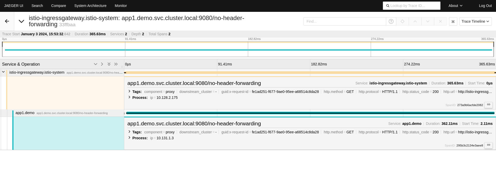
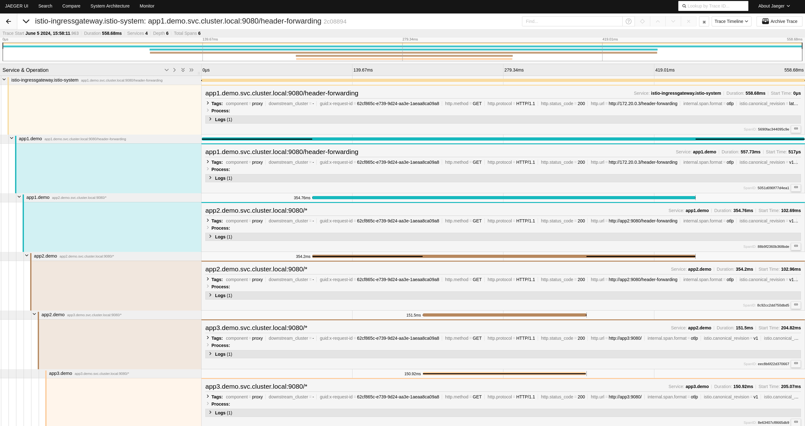

# 03 - Our traces are broken



Our traces don't look as expected. Why?

## Context propagation

Context propagation in distributed tracing refers to the mechanism of transmitting trace information across the various services involved in handling a single transaction or request in a distributed system. This process ensures that each service or microservice involved in the request contributes to a single, coherent trace that represents the entire journey of that request through the system.

### How Context Propagation Works
1. Trace Context: When a request enters the system, a trace context is created. This context typically includes a unique trace identifier and a span identifier. The trace identifier is common across all services for the particular request, while the span identifier is unique to each service’s operation within the trace.
2. Propagation: As the request moves from one service to another, the trace context is passed along with the request. This is often done using headers (e.g., HTTP headers) that carry the trace and span identifiers.
https://www.envoyproxy.io/docs/envoy/latest/intro/arch_overview/observability/tracing3. Span Creation: Each service that handles the request creates a span, which represents a single operation within the trace. The service uses the propagated context to link its span to the overall trace.

As you can maybe suspect, the context propagation is broken.

### Didn't the service mesh create the traces for me?
Yes. But there is something missing. If you don’t touch your code, then your application isn't propagating the context. Why?

1. The sidecar of `App 1` may receive a tracing context. Upon reception, this proxy sidecar creates a span and attaches it to the existing trace-id. If a tracing context is not received, a new one is created. The HTTP call is forwarded to the `App 1` container.
2. `App 1` receives the message, processes it, and sends a request to `App 2`. Because we didn’t instrument `App 1`, no tracing headers are sent.
3. `App 2` proxy sidecar does not detect a trace-id. It creates a span, believing it to be the first span because there's been no context.
4. `App 2` receives the message, processes it, and sends a request to `App 3`. Because we didn’t instrument `App 2`, no tracing headers are sent.
3. `App 3` proxy sidecar does not detect a trace-id. It creates a span, believing it to be the first span because there's been no context.

The spans will not be connected, creating a new trace per interconnection between apps. We cannot see the E2E transtaction.

But, if instead of querying `"http://$INGRESS_HOST:$INGRESS_PORT/no-header-forwarding"` we query `"http://$INGRESS_HOST:$INGRESS_PORT/header-forwarding"`, the traces will look much better.



## Forwarding context propagation: the programatic way

If you check the source code for the applications, you will find that `App 1` and `App 2` are the same (except the URL they query) and `App 3` just replies when it receives a query.

For 1 and 2 applications, we have the `no-header-forwarding` endpoint which just queries a dowstream service and returns the obtained value. Nothing special.

If we check the `header-forwarding` endpoint, the implementation is the same as `no-header-forwarding` except some headers are forwarded:
```sh
        'X-B3-Traceid',
        'X-B3-Spanid',
        'X-B3-Parentspanid',
        'X-B3-Sampled',
        'X-B3-flags',
        'X-Request-Id',
```

The propagate headers are described in the [B3-multi](https://github.com/openzipkin/b3-propagation) specification. Also, the `x-request-id` header is used by Envoy to uniquely identify a request. More information in the [envoy documentation](https://www.envoyproxy.io/docs/envoy/latest/intro/arch_overview/observability/tracing).

When those headers are propagated, the context propagation works as expected. Now we can observe our system from end to end!
