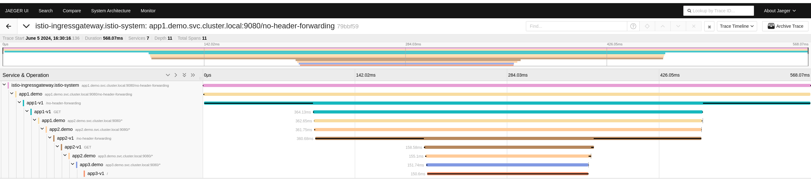

# 04 - Autoinstrumenting your application

Wouldn't it be great if we can do this automatically without modifying our code?

## The Instrumentation CR from OpenTelemetry

The Instrumentation Custom Resource (CR) in OpenTelemetry provides a Kubernetes-native way to manage the configuration and deployment of instrumentation for applications running in a Kubernetes cluster. This CR simplifies the process of adding observability to applications by defining instrumentation configurations declaratively. Here are the key aspects and benefits of the Instrumentation CR:

1. Auto-Instrumentation: Specifies the [auto-instrumentation libraries](https://opentelemetry.io/docs/languages/js/libraries/) to be used for different programming languages. This includes setting up environment variables, mounting necessary volumes, and configuring init containers or sidecars.
2. SDK Configuration: Defines settings for the OpenTelemetry SDK, such as sampling rates, resource attributes, and batching configurations.
3. Exporter Configuration: Configures how and where the collected telemetry data should be exported. This might include details for exporters like Jaeger, Prometheus, or other backends supported by OpenTelemetry.

## The propagators

OpenTelemetry supports context propagation using [propagators](https://opentelemetry.io/docs/languages/js/propagation/). A propagator in OpenTelemetry is a component responsible for injecting and extracting context information across process boundaries. Context propagation ensures that trace and baggage information can be transferred through different services, enabling distributed tracing and correlation of telemetry data across the entire request flow.

Some propagator features:

- Context Injection: When a request is sent from one service to another, the propagator adds trace context (such as trace and span IDs) to the outgoing request. This is typically done through headers in HTTP requests, but it can also be applied to other protocols like gRPC.
- Context Extraction: When a request is received by a service, the propagator extracts the trace context from the incoming request headers. This extracted context is used to continue the trace, ensuring that all spans are correctly linked.
- Baggage Propagation: Besides trace context, propagators can also handle baggage, which are key-value pairs that travel along with the trace context and can be used to pass metadata through the system.

## Injecting autoinstrumentation in our workloads

First, we need to create one `Instrumentation` instance in the `demo` namespace setting the exporter endpoint to the `OpenTelemetryCollector`:

```yaml
    endpoint: http://instance-collector.istio-system.svc.cluster.local:4318
```

And enabling the needed propagators:
```yaml
  propagators:
    - tracecontext
    - baggage
    - b3multi
```

You can create the instrumentation object with the following command:
```sh
$ kubectl create -f infra/instrumentation.yaml
instrumentation.opentelemetry.io/python created
```

Now, we need to specify the OpenTelemetry operator to inject the created instrumentation in our deployments. If you check the applications manifest (`apps/manifest.yaml`), you will find there are some annotations commented. Uncomment them:
```yaml
        instrumentation.opentelemetry.io/inject-python: "true"
```

And now, apply the manifest:
```sh
$ kubectl apply -f apps/manifest.yaml
namespace/demo unchanged
service/app1 unchanged
serviceaccount/demo-app1 unchanged
deployment.apps/app1-v1 configured
service/app2 unchanged
serviceaccount/demo-app2 unchanged
deployment.apps/app2-v1 configured
service/app3 unchanged
serviceaccount/demo-app3 unchanged
deployment.apps/app3-v1 configured
gateway.networking.istio.io/demo-gateway unchanged
virtualservice.networking.istio.io/demo unchanged
destinationrule.networking.istio.io/app1 unchanged
```

Nothing will happen now. We need to restart our deployments:
```sh
$ kubectl rollout restart deployment app1-v1 -n demo
deployment.apps/app1-v1 restarted
$ kubectl rollout restart deployment app2-v1 -n demo
deployment.apps/app2-v1 restarted
$ kubectl rollout restart deployment app3-v1 -n demo
deployment.apps/app3-v1 restarted
```

or
```sh
$ make restart-apps
kubectl rollout restart deployment app1-v1 -n demo
deployment.apps/app1-v1 restarted
kubectl rollout restart deployment app2-v1 -n demo
deployment.apps/app2-v1 restarted
kubectl rollout restart deployment app3-v1 -n demo
deployment.apps/app3-v1 restarted
```

If you check the application pods, you will find an `initContainer` was created per pod. It copied the instrumentation libraries to a volume shared with the container application and set some environment variables.

Now, we can query our uninstrumented endpoint (`"http://$INGRESS_HOST:$INGRESS_PORT/no-header-forwarding"`) and check the generated traces.


As you can see, the endpoint that was not instrumented before is properly instrumented now. And we have even more spans! Why?

Well, the autoinstrumentation libraries added context propagation forwarding the correct HTTP headers. Also, the libraries used to build those services ([`Requests`](https://pypi.org/project/requests/) and [`Flask`](https://pypi.org/project/Flask/) in this case) are instrumented too. The call to the methods from those libraries will generate spans, adding metadata and other information that can be useful to debug our applications.
